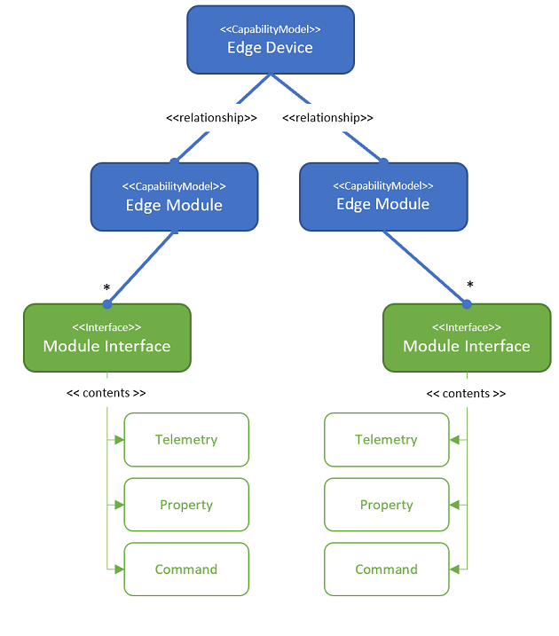

# Model and Connect Azure IoT Edge devices to an Azure IoT Central application

IoT Edge is made up of three components:

* IoT Edge modules are containers that run Azure services, partner services, or your own code. Modules are deployed to IoT Edge devices, and run locally on those devices.
* The IoT Edge runtime runs on each IoT Edge device, and manages the modules deployed to each device.
* A cloud-based interface enables you to remotely monitor and manage IoT Edge devices. IoT Central is the cloud interface.

A device template in IoT Central defines the capabilities of your device and IoT Edge modules. Capabilities include 
* telemetry the module sends 
* module properties and 
* the commands a module responds to.

In IoT Central  models an IoT Edge device as follows:

* Every IoT Edge device template has a device capability model.
* For every custom module listed in the deployment manifest, a module capability model is generated.
* A relationship is established between each module capability model and a device capability model.
* A module capability model implements module interfaces.
* Each module interface contains 
   * telemetry 
   * properties
   * commands

