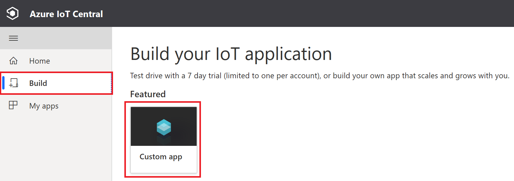
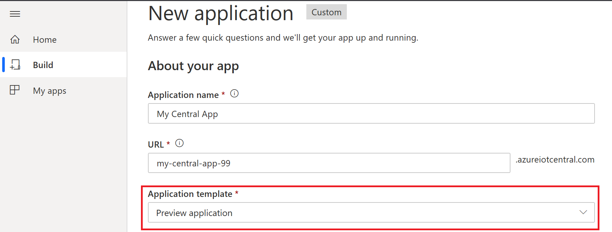

# Azure IoT Central

Azure IoT Central is a hosted IoT app platform that’s secure, scales with you as your business grows, and integrates with your existing business apps.

## Create an IoT Central Application

Using Internet Browser Go to [IoT Central App](https://apps.azureiotcentral.com)

Click **Build** on the left Nav and click **Custom app** tile. 

Create a new application. Make sure to use **Preview application**. IoT Central Edge is currently in public preview.

## Build an Azure IoT Edge Device Template
This tutorial shows you, as a builder, how to use an Azure IoT edge device template to define a new type of device in your Microsoft Azure IoT Central application. A device template defines edge modules, the telemetry, state, properties, and settings of each module and relationship with downstream devices.

Click [here](https://docs.microsoft.com/en-us/azure/iot-central/preview/tutorial-define-edge-device-type) to go to docs page which will walk you thru how to build and manage an IoT Edge device template] 