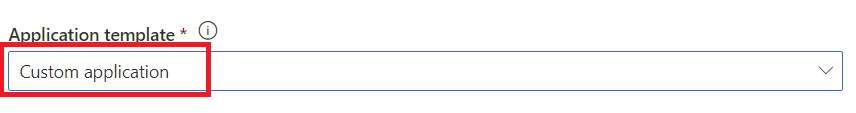

# Azure IoT Central

Azure IoT Central is a hosted IoT app platform that’s secure, scales with you as your business grows, and integrates with your existing business apps.

## Create an IoT Central Application

Using Internet Browser Go to [IoT Central App](https://apps.azureiotcentral.com)

Click **Build** on the left Nav and click **Custom app** tile. 

Create a new application. 

Make sure to use **Customer application**. 

