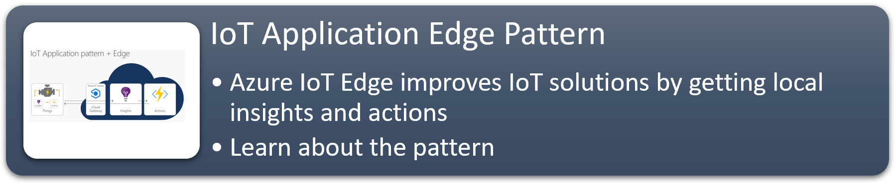
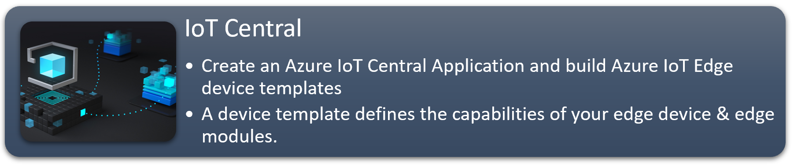
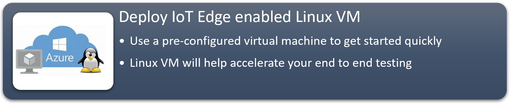
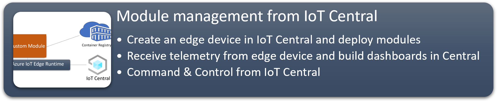
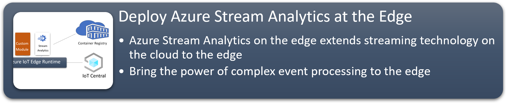
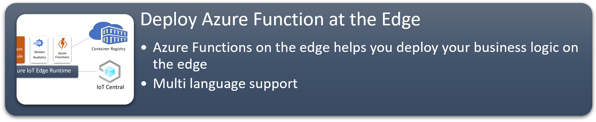

# Azure IoT Central Edge Hands On Labs With Edge Enabled MarketPlace Linux VM

## Overview

Azure IoT Central is an IoT application platform that reduces the burden and cost of developing, managing, and maintaining enterprise-grade IoT solutions. 

Azure IoT Edge is a fully managed service that delivers cloud intelligence locally by deploying and running

* Custom Logic 
* Azure Services
  * Azure Stream Analytics
  * Azure Functions
  * Azure Machine Learning
  * Azure Cognitive Services
  * Azure Event Grid
* Artificial Intelligence (AI)
 
directly on cross-platform IoT devices. Run your IoT solution securely and at scale—whether in the cloud or offline. 

This hands-on lab demonstrates what is involved in standing up an Azure IoT Edge enabled Linux VM on Azure Marketplace, managing software modules and deployments, command and control from IoT Central and running Edge Modules on the edge devices managed by Azure IoT Edge.

## Learning Modules

 

[comment]: 

## Useful Resources

 [IoT Central Edge Overview](https://docs.microsoft.com/en-us/azure/iot-central/preview/concepts-architecture#azure-iot-edge-devices)

 [Build and manage an IoT Edge device template](https://docs.microsoft.com/en-us/azure/iot-central/preview/tutorial-define-edge-device-type)

 [Connect an IoT Edge Device to Central](https://docs.microsoft.com/en-us/azure/iot-central/preview/tutorial-add-edge-as-leaf-device)
