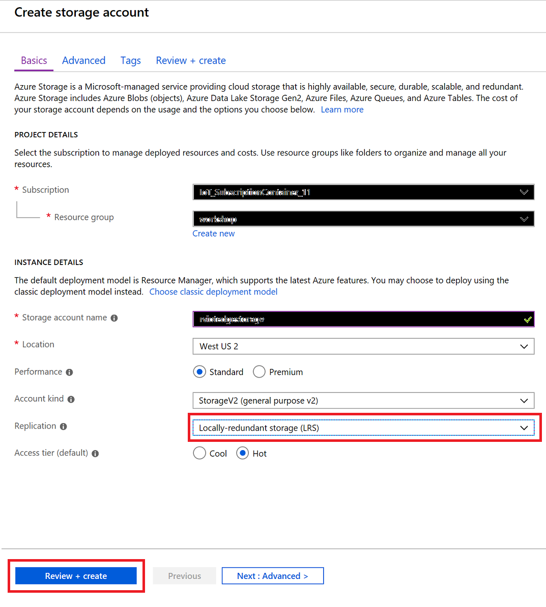
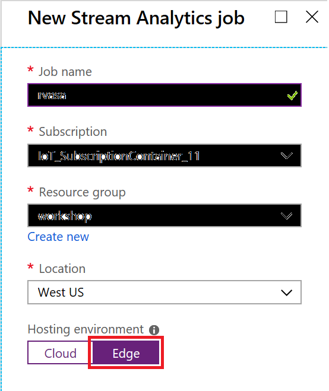
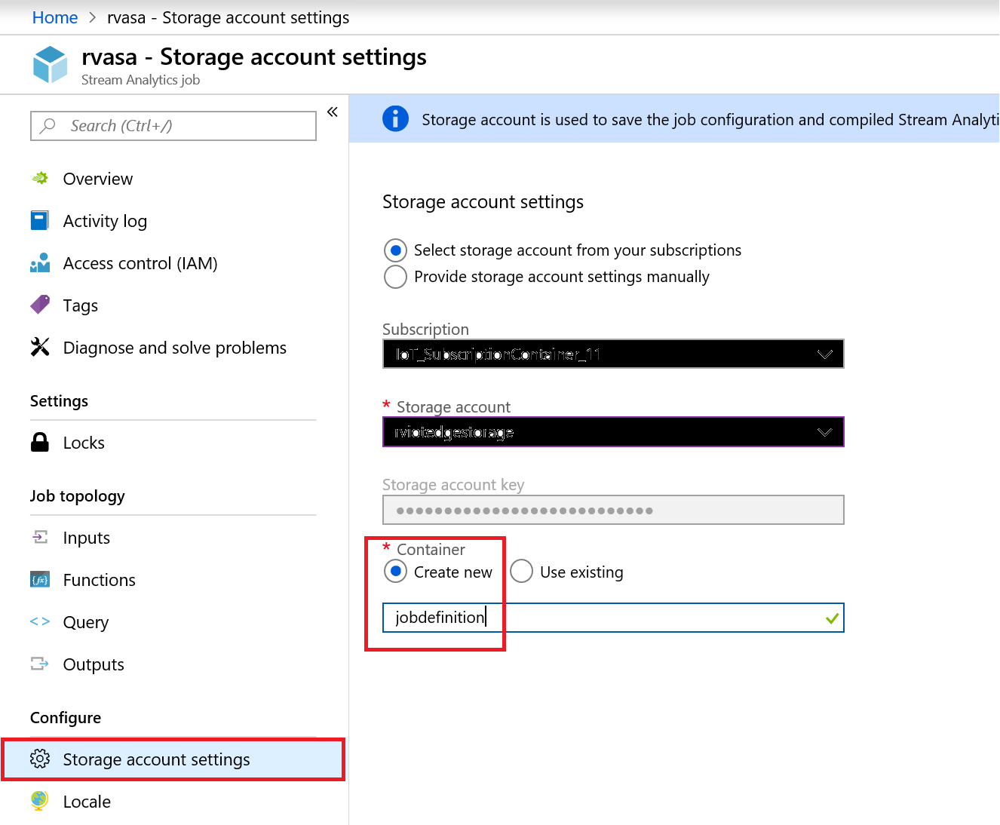

## Deploy Azure Stream Analytics as an IoT Edge module

### Overview

Azure IoT Edge and Azure Stream Analytics are integrated so that you can create an Azure Stream Analytics job in the Azure portal and then deploy it as an IoT Edge module with no additional code.

The Stream Analytics module in this task calculates the average temperature over a rolling 30-second window. When that average reaches 70, the module sends an alert for the device to take action. In this case, that action is to reset the simulated temperature sensor. 

### Create an Azure Stream Analytics job

Create an Azure Stream Analytics job to take data from your IoT hub, query the sent telemetry data from your device, and then forward the results to an Azure Blob storage container.

#### Create a storage account

When you create an Azure Stream Analytics job to run on an IoT Edge device, it needs to be stored in a way that can be called from the device. You can use an existing Azure storage account, or create a new one now.

### Create Azure Blob Storage

1. In your Web browser, to open your Azure portal, navigate to the [portal.azure.com](http://portal.azure.com).

    When you log into Azure you will arrive at the Azure portal home page for your Azure account.

2. Click **+ Create a resource** and click on **Storage** and click **Storage account - blob, file, table, queue**.

    

3. Provide details and make sure to select Locally Redundant Storage (LRS), cheapest option. Click on **Create and Review** button. Click on **Create button.

    

### Set up Azure Stream Analytics

1. Open a browser and navigate to the Azure Portal [https://portal.azure.com](https://portal.azure.com)

2. In the Azure portal, in the left-hand navigation area, click **Create a resource** -> **Internet of Things** -> **Stream Analytics Job**.

    

3. In the **New Stream Analytics job** blade, enter a globally unique name.

4.  Under **Hosting environment**, select **Edge**.

    You can see the option here for creating an analytics job that would run under the cloud or IoT Edge.

5.  At the bottom of the **New Stream Analytics job** blade, click **Create**.

    

6.  Once the deployment has succeeded, click **Go to resource**.

    The **Stream Analytics job** blade will open, displaying the **Overview** pane.

7.  On the **Stream Analytics job** blade in the left hand nav area, under **Job topology**, click **Inputs**.

8.  In the **Inputs** pane, click **Add stream input** and then select **Edge Hub**.

    The **New input** popup will then be displayed.

9.  Under **Input alias**, enter **temperature**.

10. Under **Event serialization format**, select **JSON**.

    In order to query the message data, the Analytics job must understand the message format. JSON is the standard, but AVRO and CSV are also supported.

11. Under **Encoding**, select **UTF-8**.

    UTF-8 is the only JSON encoding supported at the time of writing.

12. Under **Event compression type**, select **None**.

    GZIP and Default formats are supported.

13. At the bottom of the **New input** popup, click **Save**.

    

    The **New input** popup closes and the **Inputs** pane is displayed. The new stream input should be listed.

14. In the **Stream Analytics Job** blade left hand nav area, under **Job topology**, click **Outputs**.

    This will display the **Outputs** pane. You should see an empty list.

15. At the top of the **Outputs** pane, click **Add** and select **Edge Hub**.

    A **New output** popup will open that you can use to select the Azure Function details.

16. Under **Output alias**, enter **alert**.

17. Under **Event serialization format**, select **JSON**.

    In order to query the message data, the Analytics job must understand the message format. JSON is the standard, but AVRO and CSV are also supported.

18. Under **Encoding**, select **UTF-8**.

19. At the bottom of the **New output** popup, click **Save**.

    After a brief pause, the **New output** popup closes and the **Outputs** list updates to include the output we just created.

    

20. In the **Stream Analytics Job** blade left hand nav area, under **Job topology**, click **Query**.

    This will display the **Query** pane with a default query.

21. In the **Query** pane, replace the default query with the following:

    ```sql
    SELECT  
        'reset' AS command 
    INTO 
        alert 
    FROM 
        temperature TIMESTAMP BY timeCreated 
    GROUP BY TumblingWindow(second,30) 
    HAVING Avg(machine.temperature) > 70
    ```

22. At the top of the **Query** pane, in the toolbar, click **Save** and (if prompted) click **Yes**.

    

### Configure IoT Edge Settings

To prepare your Stream Analytics job to be deployed on an IoT Edge device, you need to associate the job with a container in a storage account. When you go to deploy your job, the job definition is exported to the storage container.

1. On the **Stream Analytics job** blade in the left hand nav area, under **Configure**, click **Storage account settings**.

2. On the **Storage account settings** pane, click **Add storage account**.

3. Select **Select storage account from your subscriptions**.

4. Under **Subscriptions**, select the subscription you wish to use.

5. Under **Storage account**, select the storage account you wish to use.

6. Under **Container**, select **Create new** and enter **jobdefinition**.

7. At the bottom of the **Storage account settings** pane, click **Save**.

    
    